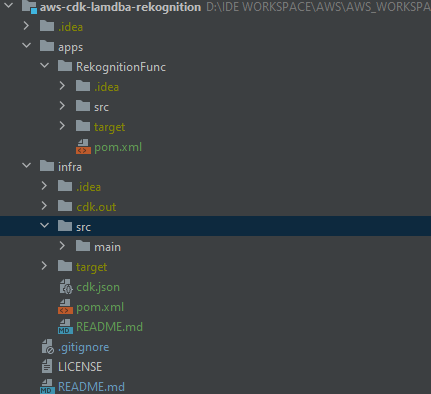

# aws-cdk-lamdba-rekognition
AWS CDK
## Pre-requisites
Make sure you have following installed
* Nodejs/NPM
* CDK CLI
* Maven

## Bootstrap CDK
Run following command once per account and per region. This will deploy CDK toolkit stack into AWS.

```cdk bootstrap aws://<AWS Account>/<Region>```

Replace `<AWS Account>` and `<REGION>` with your setting.

## Create CDK Project
Initialize for `template` and `programming language`

```cdk init app --language java```

`app` is default template. You can execute following command to list other templates

```cdk init```
## Project Structure
The project has 2 modules
* infra - infrastructure code in Java that will be used to generate template 
* apps\RekognitionFunc - contains lambda function


### infra
Setups S3 Bucket, Dynamo Table, and Lambda Function with necessary permissions.

S3 Notification to send Object Create Notification Lambda Function

### apps\RekognitionFunc
Defines Lambda Function that will process S3 Event. This will call Rekognition to detect `labels` on the image, and persist identified labels to Dynamo Table.


## Steps For this project
1. Build function jar
   ```
   cd apps\RekognitionFunc
   mvn package
   ```
   
   ```
   cd infra
   mvn package
   ```
2. Synthesize infra code (CDK). This will generate CloudFormation Template, based on the code we have written.
   
   ```
    cdk synth
   ```
   
3. deploy stack to your account/region. 
   This will use your AWS CLI profile to determine account/region. [Reference](https://docs.aws.amazon.com/cdk/v2/guide/environments.html)
   ```
   cdk deploy
   ```

4. Check Cloud Formation to verify created resources. 
5. Testing - Upload file in the created S3 bucket. This will trigger S3 Event Notification, which is handled by Lambda, and persist detected labels by Rekognition to Dynamo Table. You can also check logs from Lambda function.
6. Finally, destroy your stack.
   ```
   cdk destroy
   ```
## Note
You will also see CDK generated additional Lambda function (runtime: python). This is used internally by CDK to apply configuration S3 Notifications on the bucket. See the posting below
* https://github.com/aws/aws-cdk/issues/9552#issuecomment-677512510
